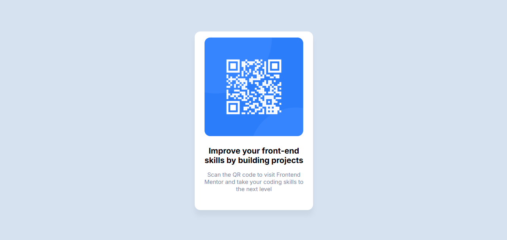

# QR Code Component

Este é um pequeno projeto de componente de QR Code, desenvolvido com **HTML** e **CSS**, baseado em um desafio do [Frontend Mentor](https://www.frontendmentor.io/).

# Guia de Estilo Front-end

## Layout

Os designs foram criados com as seguintes larguras:

- Mobile: 375px
- Desktop: 1440px

## Cores

- Branco: hsl(0, 0%, 100%)

- Cinza Claro (Slate 300): hsl(212, 45%, 89%)
- Cinza Médio (Slate 500): hsl(216, 15%, 48%)
- Cinza Escuro (Slate 900): hsl(218, 44%, 22%)

## Tipografia

### Texto do Corpo

- Tamanho da fonte (parágrafo): 15px

### Fonte

- Família: [Outfit](https://fonts.google.com/specimen/Outfit)
- Pesos: 400, 700

## 📚 Descrição

Este projeto consiste em um cartão contendo um QR Code com o objetivo de direcionar o usuário ao site do Frontend Mentor. Ele simula um componente visual que poderia ser utilizado em páginas de introdução, onboarding ou materiais promocionais.

### ✅ Objetivos

- Reproduzir um componente visual com fidelidade a um modelo fornecido.
- Praticar estruturação semântica em HTML.
- Aplicar estilizações modernas com CSS (como centralização, sombras, bordas arredondadas e tipografia responsiva).

## 🛠 Tecnologias utilizadas

- HTML5
- CSS3

## 💡 O que aprendi

- Alinhamento e centralização de conteúdo com Flexbox.
- Como usar bordas arredondadas e sombras sutis.
- Melhoria de tipografia e responsividade básica com CSS.

## 📸 Captura de tela

## 🚀 Como visualizar

Você pode abrir o arquivo `index.html` diretamente em seu navegador ou fazer o deploy com GitHub Pages ou qualquer serviço de hospedagem estática.

## 📝 Licença

Este projeto é apenas para fins de aprendizado. O desafio original está disponível no [Frontend Mentor](https://www.frontendmentor.io/).

---

Feito com ❤️ por [Chris_Valentim]
